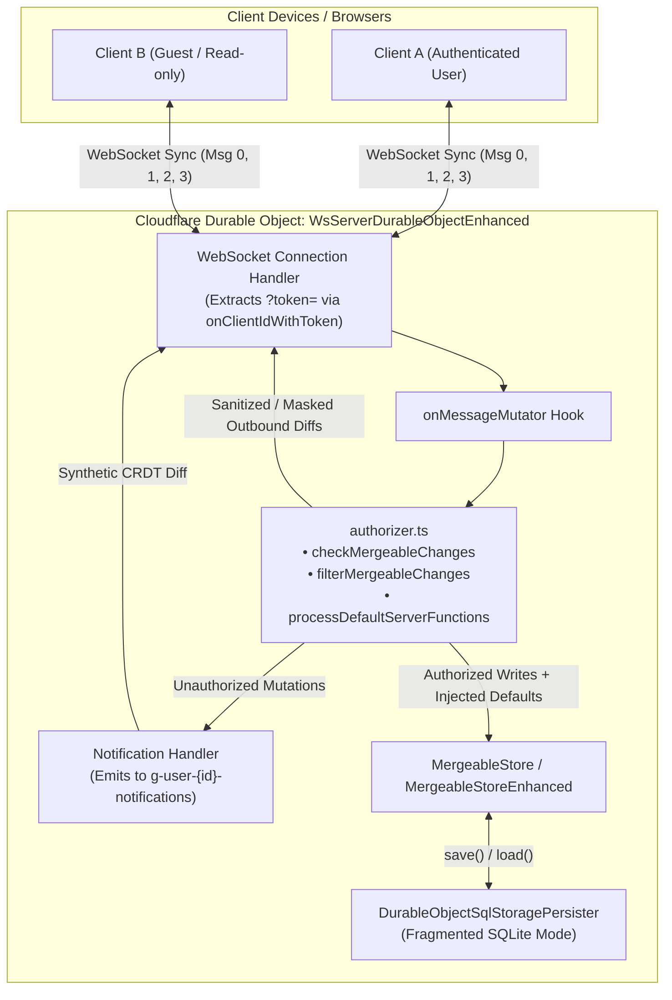

# Branch Differences: `synchronizer-enhancements` vs `main`

**Base Commit:** [`393865864c`](file:///home/corey/workspace/tinybase) (`main`, tagged `v10.0.0`)  
**Branch:** [`synchronizer-enhancements`](file:///home/corey/workspace/tinybase)  
**Total Changes:** 39 files (+5,249 lines, -39 lines)

---

## 1. Executive Summary

The `synchronizer-enhancements` branch introduces a full-stack, declarative **authorization**, **schema definition**, **server-side computed defaults**, and **granular sync-diff filtering** system to TinyBase. 

While `main` provides foundational CRDT synchronization through [MergeableStore](file:///home/corey/workspace/tinybase/src/@types/mergeable-store/index.d.ts) and basic WebSocket relaying via [WsServerDurableObject](file:///home/corey/workspace/tinybase/src/synchronizers/synchronizer-ws-server-durable-object/index.ts), it lacks built-in primitives for multi-tenant data access control, field-level permissions, and server-side lifecycle values (e.g. timestamps like `createdAt` / `updatedAt`).

This branch bridges that gap by introducing:
1. **[expanded-schema](file:///home/corey/workspace/tinybase/src/expanded-schema/index.ts)**: A fluent, ORM-like schema builder that defines rich metadata, field-level constraints, relations, and CRUD authorization policies while emitting TinyBase-compatible schemas.
2. **[authorizer](file:///home/corey/workspace/tinybase/src/common/authorizer.ts)**: A filtering and authorization engine that inspects CRDT changesets (`MergeableChanges`, `TablesStamp`, `RowHashes`, `TableHashes`), rejects unauthorized client mutations, masks unpermitted diffs per client, and injects server-computed defaults.
3. **[synchronizer-ws-server-durable-object-enhanced](file:///home/corey/workspace/tinybase/src/synchronizers/synchronizer-ws-server-durable-object-enhanced/index.ts)**: An enhanced Cloudflare Durable Object WebSocket server (`WsServerDurableObjectEnhanced`) that hooks into the sync message lifecycle, validates authentication tokens, manages authorization contexts, and dispatches automated CRDT notifications on blocked actions.
4. **[mergeable-store-enhanced](file:///home/corey/workspace/tinybase/src/mergeable-store-enhanced/index.ts)**: An authorization-aware wrapper around `MergeableStore` that prevents unauthorized table/row/cell leakage during diff calculations.
5. **[persister-durable-object-sql-storage](file:///home/corey/workspace/tinybase/src/persisters/persister-durable-object-sql-storage/index.ts) Enhancements**: Added logging options, query instrumentation, and performance optimizations for fragmented SQLite storage in Cloudflare Durable Objects.

---

## 2. Architecture & Data Flow

---

## 3. Deep Dive into Major Features

### 3.1. Expanded Schema System (`src/expanded-schema/`)

The [expanded-schema](file:///home/corey/workspace/tinybase/src/expanded-schema/index.ts) module provides a fluent builder syntax for defining database schemas with semantic metadata, authorization rules, and relations.

* **Fluent Builders**:
  - `text(id?)`, `number(id?)`, `boolean(id?)`, `date(id?)`, `datetime(id?)`, `image(id?)`
  - Chaining modifiers:
    - `.required()`: Flags the cell as mandatory.
    - `.readonly()`: Flags the cell as immutable by clients.
    - `.hidden()`: Hides the cell from standard UI display templates.
    - `.default(value | fn)`: Sets a static or client-side default value.
    - `.defaultServerFunction(fnName, ['insert', 'update'])`: Delegates value generation to server-side functions (e.g. `now` for auto-timestamps).
    - `.references(field)`: Declares foreign-key-like cell references.
    - `.authorize({create?, read?, update?, delete?})`: Binds operation rules to named authorization predicates.

* **Dual Schema Compilation (`createSchema`)**:
  Compiles a single schema definition into two representations:
  1. `schema`: Rich internal metadata containing display templates, semantic types, and table/cell authorization matrices.
  2. `tinybaseSchema`: A clean, standard TinyBase schema passed into `createStore().setSchema()`.

* **Relations Modeling (`relations`)**:
  - A helper inspired by Drizzle ORM to define bidirectional relationships between tables (`many` to `one`, `one` to `many`, `many` to `many`).

* **Server Functions (`src/expanded-schema/serverFunctions/`)**:
  - `defaults`: Built-in server functions (`today()`, `now()`).
  - `authorization`: Standard authorization functions (`isAdmin`, `isAuthenticated`, `isOwner`, `hasRole`, `allowAll`, `denyAll`).

---

### 3.2. Authorization Engine (`src/common/authorizer.ts`)

The [authorizer.ts](file:///home/corey/workspace/tinybase/src/common/authorizer.ts) module implements the permission checks and diff filtering logic:

1. **`checkMergeableChanges`**:
   - Evaluates inbound client write operations (Message Type 2 and Type 3 writes).
   - Dynamically determines if an operation is a `"create"` or `"update"` by querying `storeHasTable()` and `storeHasCell()`.
   - Rejects the mutation if the table-level or any cell-level rule fails.
2. **`filterMergeableChanges` & `filterTablesStampRead`**:
   - Evaluates outbound diffs (Message Type 1 and Type 3 reads).
   - Strips out unauthorized tables and cells based on the recipient's `AuthContext`.
   - Prunes empty rows and empty tables so unauthorized structures are completely omitted from the payload.
3. **`filterTableHashesRead` & `filterRowHashesRead`**:
   - Filters hash structures compared during synchronization diff negotiations.
   - Prevents hash divergence churn for data that a client does not have permission to read.
4. **`processDefaultServerFunctions`**:
   - Triggered upon successful write mutations.
   - Inspects schema definitions for `defaultServerFunction` triggers (`'insert'` or `'update'`).
   - Executes server functions (e.g. generating ISO timestamps) and creates a synthetic diff (`requestId + '_default'`) to broadcast the updated values to the store and all clients.

---

### 3.3. Enhanced Durable Object WebSocket Server

#### A. Base Class Updates (`src/synchronizers/synchronizer-ws-server-durable-object/index.ts`)
The upstream [WsServerDurableObject](file:///home/corey/workspace/tinybase/src/synchronizers/synchronizer-ws-server-durable-object/index.ts) was modified to expose extension hooks and state accessors:
* Changed `#serverClientSend` to `serverClientSend` (accessible by subclasses).
* Attached `this.store = store;` and `this.persister = persister;` upon resolving `createPersister()` in `ctx.blockConcurrencyWhile`.
* Added public getters `getStore()` and `getPersister()`.
* Added public `getClients(tag?: Id): WebSocket[]` method (replacing private `#getClients`).
* Exposed message dispatchers `sendMessage(fromClientId, toClientId, remainder, fromClient?)`, `sendMessageToServer(toClientId, fromClientId, remainder)`, `sendMessageToClients(clients, fromClientId, fromClient, remainder)`, and `handleMessage(fromClientId, message, fromClient?)`.
* Added `onFetch(request, pathId, clientId)` and `onMessageMutator(fromClientId, toClientId, remainder, isWrite): boolean | string` hooks.

#### B. New Enhanced Server (`src/synchronizers/synchronizer-ws-server-durable-object-enhanced/index.ts`)
The new [WsServerDurableObjectEnhanced](file:///home/corey/workspace/tinybase/src/synchronizers/synchronizer-ws-server-durable-object-enhanced/index.ts) class extends the base server in full architectural synchronization:
* **Clean Inheritance**: Inherits standard DO `fetch()` and WebSocket acceptance from the base class; hooks lifecycle via `override onFetch(request, pathId, clientId)` and `override onClientId(pathId, clientId, addedOrRemoved)` to call `onClientIdWithToken(pathId, clientId, addedOrRemoved, token)`.
* **Preserved Base Store**: Uses `declare store: MergeableStoreEnhanced | MergeableStore | null;` so subclass instantiation does not overwrite the base-initialized store.
* **Shared Dispatch Pipeline**: Replaced duplicate internal message processing with `this.sendMessage(...)`.
* **State Management**: Stores `expandedSchema`, `serverFunctions`, `getAuthContext`, and an optional structured `Logger`.
* **System Message Bypass**: Synchronous `onMessageMutator` allows server synthetic messages (`fromClientId === 'notification' | 'default' | SERVER_CLIENT_ID`) to pass without infinite authorization loops.
* **Message Interception (`onMessageMutator`)**:
  - **Message Type 1 (Server to Client Diffs)**: Authorizes and filters outbound diffs via `filterMergeableChanges`.
  - **Message Type 2 (Client to Server Changes)**: Validates write permissions via `checkMergeableChanges`. If rejected, invokes `notifyBlockedMessage()`.
  - **Message Type 3 / 0 (Broadcast Diffs)**: Validates inbound writes, applies server defaults via `processDefaultServerFunctions`, and individually filters payloads for each recipient client.
* **Notification System (`handleNotificationMessage`)**:
  - When an operation is blocked, the server synthesizes a CRDT record into `g-user-${userId}-notifications` containing `clientId`, `requestId`, `message`, `errorType`, `reason`, and `timestamp`.
  - Sends this notification update directly to both the server store and the originating client via `this.sendMessage()`.
  - Supports both `handleNotificationMessage` and backward-compatible alias `handeNotificationMessage`.
* **Worker Fetch Helper**:
  - `getWsServerDurableObjectEnhancedFetch(namespace)` delegates directly to `getWsServerDurableObjectFetch`.

---

### 3.4. Enhanced MergeableStore (`src/mergeable-store-enhanced/index.ts`)

[createMergeableStoreEnhanced](file:///home/corey/workspace/tinybase/src/mergeable-store-enhanced/index.ts) wraps TinyBase's standard [MergeableStore](file:///home/corey/workspace/tinybase/src/@types/mergeable-store/index.d.ts):
* **Custom Clock Support**: Accepts optional `getNow?: GetNow` and forwards it to `createMergeableStore(uniqueId, getNow)`.
* **Full Schemas Variant Support**: Type definitions provide full generic support for `MergeableStoreEnhanced<Schemas>` and re-export via `with-schemas`.
* **Diff Authorization Filtering**: Overrides diff methods:
  - `getMergeableTableDiff(otherTableHashes)`
  - `getMergeableRowDiff(otherTableRowHashes)`
  - `getMergeableCellDiff(otherTableRowCellHashes)`
  - `getTransactionMergeableChanges(withHashes)`
* Evaluates read permissions for the store's current `AuthContext` on every diff calculation, ensuring unauthorized tables, rows, cells, and hashes are never exposed.

---

### 3.5. Durable Object SQL Storage Persister Updates (`src/persisters/persister-durable-object-sql-storage/`)

Changes in [persister-durable-object-sql-storage](file:///home/corey/workspace/tinybase/src/persisters/persister-durable-object-sql-storage/index.ts):
* **Logging Support**: Added `options?: Options` with an optional `log?: (...message: unknown[]) => void` callback.
* **SQL Command Interception**: Created `execSql(sql, ...bindings)` to route queries through `onSqlCommand` in fragmented mode.
* **Fragmented Storage Instrumentation**: Added logging for table initialization, row loading, metadata persistence, and write counts.
* **Query Performance**: Uses `execSql(...).toArray()` directly on Cloudflare SQL query cursors.
* **API Documentation**: Added documentation and TypeScript types for `Options.log` and `persister.getLog()`.

---

## 4. File-by-File Differences Matrix

| File Path | Status | Diff Size | Summary of Changes |
| :--- | :---: | :---: | :--- |
| [`.vscode/settings.json`](file:///.vscode/settings.json) | **Added** | +6 | Configured Biome formatter for TypeScript and Prettier for other files. |
| [`docs/index.html`](file:///docs/index.html) | **Modified** | ~0 | Line formatting / whitespace update. |
| [`gulpfile.mjs`](file:///gulpfile.mjs) | **Modified** | +3 | Registered `mergeable-store-enhanced`, `expanded-schema`, and `synchronizer-ws-server-durable-object-enhanced` modules. |
| [`index.bak.ts`](file:///index.bak.ts) | **Added** | +267 | Standalone backup/scratch file of the original DO synchronizer. |
| [`package-lock.json`](file:///package-lock.json) | **Modified** | +784 / -14 | Updated dependencies (Metro & React Native build toolchains). |
| [`readme.md`](file:///readme.md) | **Modified** | ~0 | Line formatting / whitespace update. |
| [`src/index.ts`](file:///src/index.ts) | **Modified** | +2 | Exported `expanded-schema` and `mergeable-store-enhanced`. |
| [`src/tsconfig.tsbuildinfo`](file:///src/tsconfig.tsbuildinfo) | **Added** | +1 | TypeScript build information cache. |
| [`src/common/authorizer.ts`](file:///src/common/authorizer.ts) | **Added** | +804 | Core authorization engine, diff filtering, hash filtering, and server defaults processor. |
| [`src/expanded-schema/index.ts`](file:///src/expanded-schema/index.ts) | **Added** | +4 | Entry point exporting schema creators, types, server functions, and schema definitions. |
| [`src/expanded-schema/schemaCreator.ts`](file:///src/expanded-schema/schemaCreator.ts) | **Added** | +365 | Schema builder (`text`, `number`, `boolean`, `datetime`, `image`), dual-schema compilation (`createSchema`), and `relations()`. |
| [`src/expanded-schema/types.ts`](file:///src/expanded-schema/types.ts) | **Added** | +58 | Semantic types (`MetaType`), authorization types (`AuthOperation`, `AuthorizationConfig`), and relations types. |
| [`src/expanded-schema/tinybaseSchemas.ts`](file:///src/expanded-schema/tinybaseSchemas.ts) | **Added** | +168 | Sample and test schema definitions (`getUserSchema`, `productSchema`, `testSchema`, `genieSchema`). |
| [`src/expanded-schema/serverFunctions/index.ts`](file:///src/expanded-schema/serverFunctions/index.ts) | **Added** | +7 | Aggregator for defaults and authorization server functions. |
| [`src/expanded-schema/serverFunctions/authorization.ts`](file:///src/expanded-schema/serverFunctions/authorization.ts) | **Added** | +64 | Built-in authorization predicates (`isAdmin`, `isAuthenticated`, `isOwner`, `hasRole`, `allowAll`, `denyAll`). |
| [`src/expanded-schema/serverFunctions/default.ts`](file:///src/expanded-schema/serverFunctions/default.ts) | **Added** | +8 | Built-in default value generators (`today`, `now`). |
| [`src/mergeable-store-enhanced/index.ts`](file:///src/mergeable-store-enhanced/index.ts) | **Added** | +212 | Authorization-filtering wrapper around `MergeableStore` for diff operations with `getNow` support. |
| [`src/persisters/persister-durable-object-sql-storage/index.ts`](file:///src/persisters/persister-durable-object-sql-storage/index.ts) | **Modified** | +49 / -10 | Added `Options.log` logging, `execSql` wrapper for `onSqlCommand`, and `.toArray()` optimizations. |
| [`src/synchronizers/synchronizer-ws-server-durable-object/index.ts`](file:///src/synchronizers/synchronizer-ws-server-durable-object/index.ts) | **Modified** | +150 / -20 | Exposed `serverClientSend`, `store`, `persister`, `getStore`, `getPersister`, `getClients`, `sendMessage`, `onFetch`, and `onMessageMutator`. |
| [`src/synchronizers/synchronizer-ws-server-durable-object-enhanced/index.ts`](file:///src/synchronizers/synchronizer-ws-server-durable-object-enhanced/index.ts) | **Modified/Added** | +532 | `WsServerDurableObjectEnhanced` extending base class, inheriting `fetch()`, hooking `onClientIdWithToken`, using `sendMessage()`, and handling notifications. |
| [`src/@types/index.d.ts`](file:///src/@types/index.d.ts) | **Modified** | +2 | Exported `expanded-schema` and `mergeable-store-enhanced` types. |
| [`src/@types/with-schemas/index.d.ts`](file:///src/@types/with-schemas/index.d.ts) | **Modified** | +2 | Exported `expanded-schema` and `mergeable-store-enhanced` with-schemas types. |
| [`src/@types/expanded-schema/*`](file:///src/@types/expanded-schema) | **Added** | +903 | TypeScript type definitions and documentation for `expanded-schema` (including `with-schemas` variant). |
| [`src/@types/mergeable-store-enhanced/*`](file:///src/@types/mergeable-store-enhanced) | **Added** | +500 | TypeScript type definitions and documentation for `mergeable-store-enhanced` (including `with-schemas` variant and `getNow`). |
| [`src/@types/persisters/docs.js`](file:///src/@types/persisters/docs.js) | **Modified** | +10 | Documentation for `DpcJson.log`. |
| [`src/@types/persisters/index.d.ts`](file:///src/@types/persisters/index.d.ts) | **Modified** | +2 | Added `log?: boolean` to `DpcJson`. |
| [`src/@types/persisters/persister-durable-object-sql-storage/*`](file:///src/@types/persisters/persister-durable-object-sql-storage) | **Modified** | +96 / -2 | Added `Options`, `Options.log`, and `DurableObjectSqlStoragePersister.getLog()`. |
| [`src/@types/synchronizers/synchronizer-ws-server-durable-object/*`](file:///src/@types/synchronizers/synchronizer-ws-server-durable-object) | **Modified** | +85 | Added `store`, `persister`, getters, `sendMessage`, `getClients`, and mutator definitions. |
| [`src/@types/synchronizers/synchronizer-ws-server-durable-object-enhanced/*`](file:///src/@types/synchronizers/synchronizer-ws-server-durable-object-enhanced) | **Added** | +195 | Complete type definitions extending base DO server with schema generic support and notifications. |

---

## 5. Observations & In-Progress Items

1. **Stray / Backup Files**:
   - [`index.bak.ts`](file:///index.bak.ts): A backup file of `synchronizer-ws-server-durable-object` is checked into the repository root.
   - [`src/tsconfig.tsbuildinfo`](file:///src/tsconfig.tsbuildinfo): Build artifact tracked in git (should usually be in `.gitignore`).
2. **Synchronization of Enhanced Classes Completed**:
   - `WsServerDurableObjectEnhanced` now cleanly extends `WsServerDurableObject`, inherits `fetch()`, hooks `onFetch` / `onClientId`, reuses `sendMessage()`, avoids subclass property collision with `declare store`, and supports `handleNotificationMessage` (with `handeNotificationMessage` backwards-compatible alias).
   - `MergeableStoreEnhanced` now supports `getNow?: GetNow` and has full generic typing across both standard and `with-schemas` declarations.
3. **Tests**:
   - While type declarations and runtime implementations are comprehensive, no unit or integration tests for `expanded-schema`, `authorizer`, or `synchronizer-ws-server-durable-object-enhanced` were added under `test/`.
4. **Backward Compatibility**:
   - All enhancements to existing APIs (e.g., `WsServerDurableObject`, `createDurableObjectSqlStoragePersister`) are backward compatible. Applications using the standard `WsServerDurableObject` remain unaffected unless they opt into `onMessageMutator` or use `WsServerDurableObjectEnhanced`.

