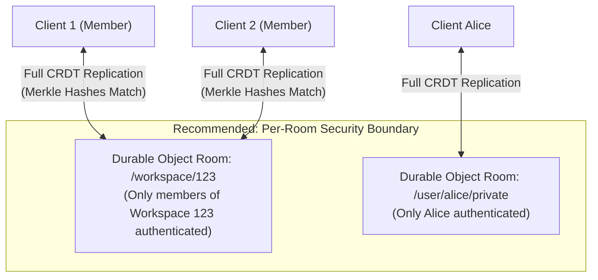

# Usage Guide: `synchronizer-enhancements`

This guide covers the new features introduced in the `synchronizer-enhancements` branch of TinyBase, including:
- **Authentication & Room Access Control** (`WsServerDurableObject.onAuthenticate`)
- **User Session Tagging & Multi-Client Lookups** (`getUserId`, `getUserClients`, `getClients`)
- **Direct Server Store & Persister Access** (`getStore`, `getPersister`)
- **Message Lifecycle Hooks** (`onFetch`, `onMessageMutator`, `sendMessage`)
- **Enhanced Durable Object Synchronizer** (`WsServerDurableObjectEnhanced`, structured logging)
- **DO SQL Storage Persister Instrumentation** (`options.log`, query logging, optimized cursor reads)
- **Expanded Schema Builder** (`text`, `number`, `boolean`, `datetime`, `createSchema`, `relations`)
- **Enhanced MergeableStore** (`createMergeableStoreEnhanced`, custom clock support)
- **CRDT Architecture & Security Boundary Best Practices**

---

## 1. Authentication & Room Access Control

The base [`WsServerDurableObject`](src/synchronizers/synchronizer-ws-server-durable-object/index.ts) now features an asynchronous `onAuthenticate` lifecycle hook that executes before the WebSocket handshake is accepted.

### Hook Specification

```ts
onAuthenticate(
  request: Request,
  pathId: Id,
): Promise<AuthContext | boolean | null | Response> 
 | AuthContext 
 | boolean 
 | null 
 | Response
```

### Return Values & Behavior

| Return Value | HTTP Response | WebSocket Upgraded? | Tags Assigned |
| :--- | :---: | :---: | :--- |
| `{userId: 'user_123', ...}` (`AuthContext`) | `101 Switching Protocols` | **Yes** | `[clientId, pathId, userId]` |
| `true` | `101 Switching Protocols` | **Yes** | `[clientId, pathId]` |
| `false` or `null` | `401 Unauthorized` | **No** | None |
| `new Response('...', {status: 403})` | Custom (`403`, etc.) | **No** | None |

### Example: Token Authentication & Room-Based Access

```ts
import {
  WsServerDurableObject,
  getWsServerDurableObjectFetch,
  type AuthContext,
} from 'tinybase/synchronizers/synchronizer-ws-server-durable-object';

export class CollaborativeRoomDO extends WsServerDurableObject {
  override async onAuthenticate(
    request: Request,
    pathId: string,
  ): Promise<AuthContext | boolean | null | Response> {
    const url = new URL(request.url);
    const token = url.searchParams.get('token');

    // 1. Missing or invalid token -> 401 Unauthorized
    if (!token) {
      return null; // Automatically responds with HTTP 401
    }

    // 2. Validate token (e.g. verify JWT, session token, etc.)
    const user = await verifyToken(token);
    if (!user) {
      return false; // Responds with HTTP 401
    }

    // 3. Room-level authorization check:
    // Ensure the user has permission to join this specific room/path
    const isAllowed = await checkUserRoomAccess(user.id, pathId);
    if (!isAllowed) {
      return new Response('Forbidden: Access to this room is denied', {
        status: 403,
      });
    }

    // 4. Return AuthContext with userId to automatically tag the WebSocket
    return {
      userId: user.id,
      role: user.role,
      isAuthenticated: true,
    };
  }
}

export default {
  fetch: getWsServerDurableObjectFetch('COLLABORATIVE_ROOMS'),
};
```

---

## 2. User Session Tagging & Multi-Client Lookups

When `onAuthenticate` returns an object containing `userId`, the server attaches `userId` as the third tag on the WebSocket (`[clientId, pathId, userId]`). You can then inspect and query connected sessions.

### Client & User Query Methods

```ts
export class MyDurableObject extends WsServerDurableObject {
  someMethod(ws: WebSocket) {
    // 1. Get the authenticated userId for a specific client WebSocket
    const userId = this.getUserId(ws); // e.g. 'user_123'

    // 2. Find all active WebSockets belonging to a specific user across all tabs/devices
    const userSockets = this.getUserClients('user_123'); // WebSocket[]

    // 3. Get all connected WebSockets in this room
    const allSockets = this.getClients(); // WebSocket[]

    // 4. Get WebSockets matching a specific tag (clientId, pathId, or userId)
    const clientSockets = this.getClients('client_abc');

    // 5. Get list of active client IDs
    const clientIds = this.getClientIds(); // string[]

    // 6. Get the current room / path ID
    const currentPath = this.getPathId(); // string
  }
}
```

---

## 3. Direct Server Store & Persister Access

`WsServerDurableObject` exposes typed getters to access its internal server store and persister:

```ts
export class MyDurableObject extends WsServerDurableObject {
  async inspectRoomData() {
    // Access the server MergeableStore instance
    const store = this.getStore();
    if (store) {
      console.log('Current tables:', store.getTableIds());
      console.log('Room metadata:', store.getValue('roomMeta'));
    }

    // Access the server persister
    const persister = this.getPersister();
    if (persister) {
      // Trigger an explicit load or save if needed
      await persister.save();
    }
  }
}
```

---

## 4. Message Lifecycle Hooks & Mutation

You can inspect or intercept synchronization messages before they propagate between clients or to the server store.

### `onMessageMutator`

```ts
export class MyDurableObject extends WsServerDurableObject {
  override onMessageMutator(
    fromClientId: string,
    toClientId: string,
    remainder: string,
    isWrite: boolean,
  ): boolean | string {
    // isWrite === true: client sending changes to the server store
    // isWrite === false: message directed between peers or server to client

    // Return `false` to drop/block the message
    // Return `true` to allow the original message
    // Return a modified `string` to transform the payload
    return true;
  }
}
```

### Granular Message Dispatching

Subclasses can trigger manual message broadcasts or direct sends:

```ts
// Send message from an internal ID to another client
this.sendMessage(fromClientId, toClientId, remainder);

// Send message to the server store
this.sendMessageToServer(toClientId, fromClientId, remainder);

// Send message to a target set of WebSockets
this.sendMessageToClients(clientSockets, fromClientId, fromClient, remainder);
```

---

## 5. Enhanced Durable Object Synchronizer (`WsServerDurableObjectEnhanced`)

[`WsServerDurableObjectEnhanced`](src/synchronizers/synchronizer-ws-server-durable-object-enhanced/index.ts) extends `WsServerDurableObject` with structured logging and token lifecycle events.

### Usage Example

```ts
import {
  WsServerDurableObjectEnhanced,
  getWsServerDurableObjectEnhancedFetch,
} from 'tinybase/synchronizers/synchronizer-ws-server-durable-object-enhanced';

export class EnhancedSyncDO extends WsServerDurableObjectEnhanced {
  constructor(ctx: DurableObjectState, env: unknown) {
    super(ctx, env);

    // 1. Configure structured logger
    this.setLogger((level, message, context) => {
      console.log(`[${level.toUpperCase()}] ${message}`, context ?? '');
    });
  }

  // 2. Lifecycle hook with query token
  override onClientIdWithToken(
    pathId: string,
    clientId: string,
    addedOrRemoved: 1 | -1,
    token: string,
  ) {
    if (addedOrRemoved === 1) {
      console.log(`Client ${clientId} joined room ${pathId} with token ${token}`);
    } else {
      console.log(`Client ${clientId} left room ${pathId}`);
    }
  }
}

export default {
  fetch: getWsServerDurableObjectEnhancedFetch('ENHANCED_ROOMS'),
};
```

---

## 6. Durable Object SQL Storage Persister Enhancements

The DO SQL Storage Persister (`createDurableObjectSqlStoragePersister`) now supports execution logging, query instrumentation, and faster cursor operations using `.toArray()`.

### Configuration Options

```ts
import {createDurableObjectSqlStoragePersister} from 'tinybase/persisters/persister-durable-object-sql-storage';
import {createMergeableStore} from 'tinybase';

const store = createMergeableStore('serverStore');

const persister = createDurableObjectSqlStoragePersister(
  store,
  ctx.storage.sql,
  {
    mode: 'fragmented', // Or DpcJson config
  },
  // onSqlCommand callback (logs raw queries and params)
  (sql, params) => console.log('Executing SQL:', sql, params),
  // onIgnoredError callback
  (err) => console.error('Persistence error:', err),
  // New Options object with structured log callback
  {
    log: (msg) => console.log('[DurableObjectSqlStorage]', msg),
  },
);

await persister.load();
await persister.startAutoSave();
```

---

## 7. Expanded Schema System

[`tinybase/expanded-schema`](src/expanded-schema/index.ts) provides a fluent, ORM-like builder for defining rich table schemas, cell constraints, server defaults, and relations while compiling cleanly to TinyBase's native schema format.

### Defining Tables and Compiling Schemas

```ts
import {
  createSchema,
  text,
  number,
  boolean,
  datetime,
  relations,
} from 'tinybase/expanded-schema';
import {createStore} from 'tinybase';

// 1. Define 'users' table
const usersDefinition = createSchema(
  'users',
  {
    id: text().required(),
    username: text().required(),
    email: text(),
    role: text().default('member'),
    createdAt: datetime().defaultServerFunction('now', ['insert']),
  },
  '{{username}}', // UI display template
);

// 2. Define 'documents' table
const documentsDefinition = createSchema(
  'documents',
  {
    id: text().required(),
    authorId: text().required().references('users.id'),
    title: text().required(),
    content: text().default(''),
    isArchived: boolean().default(false),
    viewCount: number().default(0),
    updatedAt: datetime().defaultServerFunction('now', ['insert', 'update']),
  },
  '{{title}}',
);

// 3. Compile TinyBase schema and apply to a store
const store = createStore();
store.setSchema({
  ...usersDefinition.tinybaseSchema,
  ...documentsDefinition.tinybaseSchema,
});
```

### Relations Modeling

```ts
// Define bidirectional relationships between users and documents
const [userToDocs, docsToUser] = relations(
  usersDefinition,
  'id',
  'many',
  documentsDefinition,
  'authorId',
  'one',
);
```

---

## 8. Enhanced MergeableStore (`createMergeableStoreEnhanced`)

[`createMergeableStoreEnhanced`](src/mergeable-store-enhanced/index.ts) wraps TinyBase's standard `MergeableStore` with schema awareness, authorization context, and optional custom clock synchronization.

```ts
import {createMergeableStoreEnhanced} from 'tinybase/mergeable-store-enhanced';

// Create enhanced store with custom clock (GetNow)
const store = createMergeableStoreEnhanced('clientStore', () => Date.now() * 1000);

// Attach auth context
store.setAuthContext({
  userId: 'user_123',
  role: 'editor',
  isAuthenticated: true,
});

// Set schema
store.setSchema(usersDefinition.tinybaseSchema);
```

---

## 9. Architectural Best Practices: CRDTs & Security Boundaries

When building collaborative applications with TinyBase CRDTs and Cloudflare Durable Objects, follow these architectural principles:



1. **Enforce Authorization at the Room Boundary**:
   Use `onAuthenticate` to reject unauthorized users (HTTP `401` or `403`) before the WebSocket handshake.
2. **Never Prune or Filter Diff Messages on the Wire**:
   TinyBase uses Merkle tree hash negotiation (`tablesHash`, `rowHash`, `cellHash`). Pruning records per-user causes persistent Merkle tree hash divergence, infinite synchronization loops, and broken optimistic updates.
3. **Partition Sensitive Data Across Rooms**:
   Keep user-private data in a private room DO (e.g. `/user/:userId`), and shared collaborative data in shared room DOs (e.g. `/project/:projectId`). Both stores can be synchronized concurrently on the client.

