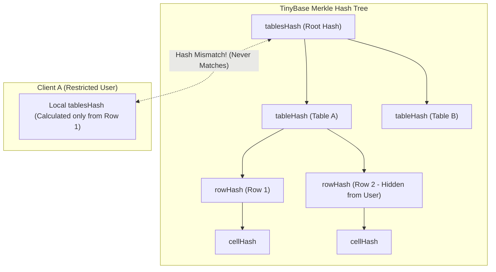
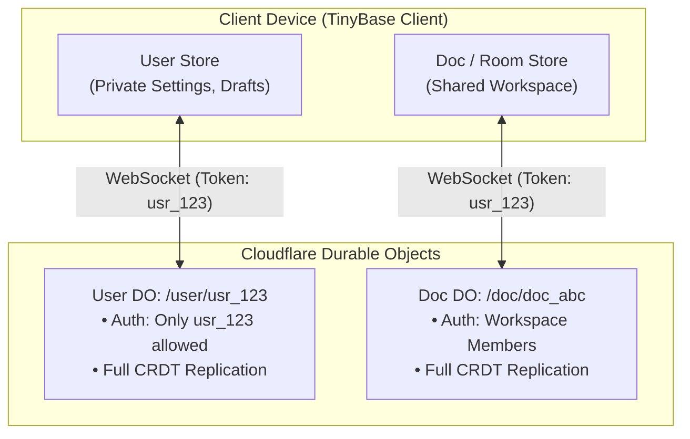

# Technical Assessment & Strategic Plan: Per-User Filtering & Authorization in TinyBase

## 1. Executive Summary & Verdict

### Verdict: **REJECT / FUNDAMENTALLY RE-ARCHITECT**
The approach implemented in the [`synchronizer-enhancements`](file:///home/corey/workspace/tinybase/BRANCH_DIFF.md) branch—attempting to implement per-user filtering by intercepting and pruning CRDT sync messages on the wire—is **fundamentally incompatible with the mathematical foundation of TinyBase's CRDT engine**. Furthermore, the current implementation violates the TinyBase synchronizer wire protocol, leading to immediate protocol validation errors and permanent client desynchronization.

### High-Level Summary of Findings
| Area | Status | Impact |
| :--- | :---: | :--- |
| **CRDT Convergence** | ❌ Broken | Slicing diffs per-user guarantees perpetual Merkle hash divergence and infinite sync loops. |
| **Optimistic Writes** | ❌ Broken | Client writes locally first; server rejects on wire without rollback, leaving client permanently diverged. |
| **Protocol Integrity** | ❌ Broken | Server handler misinterprets Message Types 1, 2, and 0, triggering `1007` protocol errors. |
| **Row Authorization** | ❌ Missing | Schema system lacks row-level rules; `isOwner` comparison logic always evaluates to `false`. |
| **Stamp Hashes** | ❌ Corrupted | Pruning cells/rows while keeping parent hashes sends malformed CRDT stamps to clients. |
| **Room/Store Boundaries** | ⚠️ Misaligned | A single Durable Object store cannot hold a single `AuthContext` for multi-user diff calculation. |

---

## 2. Core Architectural Conflict: CRDT Merkle Sync vs. Per-User Diff Filtering

TinyBase’s [`MergeableStore`](file:///home/corey/workspace/tinybase/src/@types/mergeable-store/index.d.ts) is a state-based / delta-state Conflict-free Replicated Data Type (CRDT) designed for **whole-store replication** across peers within a single document or room.



### 2.1. The Perpetual Hash Divergence Trap
1. **Merkle Sync Mechanism**: TinyBase synchronizes stores by comparing hierarchical hashes:
   - Root: `ContentHashes` (`[tablesHash, valuesHash]`)
   - Tables: `TableHashes` (hash per table)
   - Rows: `RowHashes` (hash per row in a table)
   - Cells: `CellHashes` (hash per cell in a row)
2. **The Divergence**: If the server filters out records (e.g., hiding Row 2 from Client A), Client A computes its Merkle tree without Row 2. Client A's root hash and table hashes **will never match** the server's root hash.
3. **The Infinite Loop**:
   - TinyBase detects that Client A's `tablesHash !== serverTablesHash`.
   - The synchronizer initiates diff requests: [`GetTableDiff` (4)](file:///home/corey/workspace/tinybase/src/synchronizers/index.ts#L66) $\rightarrow$ [`GetRowDiff` (5)](file:///home/corey/workspace/tinybase/src/synchronizers/index.ts#L67) $\rightarrow$ [`GetCellDiff` (6)](file:///home/corey/workspace/tinybase/src/synchronizers/index.ts#L68).
   - The server filters the diffs and returns an empty or partial set.
   - Client A applies the diff, but because Row 2 was withheld, its hashes still do not match.
   - Result: **Continuous sync thrashing**, high network traffic, and CPU exhaustion on every tick.

### 2.2. The Optimistic Write / Desynchronization Dilemma
TinyBase is a local-first store:
1. When a user creates or edits a row, the write is applied **immediately and optimistically** to the client's local [`MergeableStore`](file:///home/corey/workspace/tinybase/src/@types/mergeable-store/index.d.ts).
2. The client synchronizer attempts to send the mutation to the server via WebSocket.
3. In [`WsServerDurableObjectEnhanced.prototype.onMessageMutator`](file:///home/corey/workspace/tinybase/src/synchronizers/synchronizer-ws-server-durable-object-enhanced/index.ts#L471-L484), the server rejects the write and drops the message.
4. **No Rollback Mechanism**: The server does not send a compensating rollback diff to the client. The client’s local store retains the unauthorized mutation indefinitely while the server and other clients never see it.

### 2.3. Tombstone & Deletion Ambiguity
CRDTs track deletions using Hybrid Logical Clock (HLC) deletion stamps (tombstones). If a record is omitted from a client because of access control:
- The client cannot distinguish between *"this record does not exist"*, *"this record was deleted"*, and *"I am not allowed to view this record"*.
- If the user later gains access to the record, standard CRDT delta reconciliation cannot cleanly hydrate missing historical state without full re-synchronization.

---

## 3. Codebase Audit: Detailed Flaws in `synchronizer-enhancements`

### 3.1. Synchronizer Wire Protocol Mismatches
In [`src/synchronizers/index.ts`](file:///home/corey/workspace/tinybase/src/synchronizers/index.ts#L50-L70), the TinyBase message enum is explicitly defined:
```ts
const enum MessageValues {
  Response = 0,
  GetContentHashes = 1,
  ContentHashes = 2,
  ContentDiff = 3,
  GetTableDiff = 4,
  GetRowDiff = 5,
  GetCellDiff = 6,
  GetValueDiff = 7,
}
```

However, [`WsServerDurableObjectEnhanced.ts`](file:///home/corey/workspace/tinybase/src/synchronizers/synchronizer-ws-server-durable-object-enhanced/index.ts#L298-L389) makes incorrect assumptions about message semantics:

```ts
// BUG 1: Line 298
// Assumes Message 1 is "Server sending diffs to a client"
if (message === 1) {
  const [mergeableChanges] = body as [MergeableChanges<true>];
  const filteredChanges = filterMergeableChanges(...);
  return JSON.stringify([requestId, message, filteredChanges]);
}
```
* **Reality**: Message 1 is [`GetContentHashes`](file:///home/corey/workspace/tinybase/src/synchronizers/index.ts#L52), where `body` is strictly `""` ([`EMPTY_STRING`](file:///home/corey/workspace/tinybase/src/synchronizers/common.ts#L204-L205)).
* **Impact**: Mutating this message into `[requestId, 1, filteredChanges]` violates [`isBodyValid(1, body)`](file:///home/corey/workspace/tinybase/src/synchronizers/common.ts#L204), causing the receiving client to trigger [`ERROR_SYNC_MESSAGE`](file:///home/corey/workspace/tinybase/src/synchronizers/common.ts#L329) and close the WebSocket with error code `1007`.

```ts
// BUG 2: Line 338
// Assumes Message 2 is "Client pushing changes to the server"
if (message === 2) {
  const [mergeableChanges] = body as [MergeableChanges<true>];
  const checkResult = checkMergeableChanges(...);
  ...
}
```
* **Reality**: Message 2 is [`ContentHashes`](file:///home/corey/workspace/tinybase/src/synchronizers/index.ts#L53), where `body` is `[tablesHash, valuesHash]`. It contains no table or row changesets.
* **Impact**: Passing hash numbers into [`checkMergeableChanges`](file:///home/corey/workspace/tinybase/src/common/authorizer.ts#L447) causes it to reject valid hash exchange messages.

```ts
// BUG 3: Line 389
// Bundles Message 0 and Message 3
if (message === 3 || message === 0) { ... }
```
* **Reality**: Message 0 is [`Response`](file:///home/corey/workspace/tinybase/src/synchronizers/index.ts#L51), which can return hashes, table diffs, row diffs, or cell stamps. It is not exclusively a `ContentDiff` (`MergeableChanges`).
* **Unmonitored Messages**: Messages 4, 5, 6, and 7 ([`GetTableDiff`](file:///home/corey/workspace/tinybase/src/synchronizers/index.ts#L55), [`GetRowDiff`](file:///home/corey/workspace/tinybase/src/synchronizers/index.ts#L56), [`GetCellDiff`](file:///home/corey/workspace/tinybase/src/synchronizers/index.ts#L57)) bypass [`onMessageMutator`](file:///home/corey/workspace/tinybase/src/synchronizers/synchronizer-ws-server-durable-object-enhanced/index.ts#L547-L552) completely, allowing unmutated diffs to flow across the wire.

### 3.2. Missing Row-Level Schema & Broken `isOwner` Logic
1. **Schema Scope**: [`expanded-schema/schemaCreator.ts`](file:///home/corey/workspace/tinybase/src/expanded-schema/schemaCreator.ts#L222-L231) only defines `tableAuthorization` and cell-level `authorize`. There is no schema construct for row-level permissions (e.g. `row.ownerId === context.userId`).
2. **Broken Predicate Execution**:
   In [`expanded-schema/serverFunctions/authorization.ts`](file:///home/corey/workspace/tinybase/src/expanded-schema/serverFunctions/authorization.ts#L38-L40):
   ```ts
   isOwner: (context: AuthContext, resourceOwnerId?: string): boolean => {
     return context.userId === resourceOwnerId;
   }
   ```
   In [`common/authorizer.ts`](file:///home/corey/workspace/tinybase/src/common/authorizer.ts#L170-L184):
   ```ts
   serverFunctions.authorization[cellAuthRule]?.(authContext, {
     tablesStamp, tableStamp, tableId, rowStamp, rowId, cellStamp, cellId, action: "read"
   })
   ```
   The second argument passed to `isOwner` is a metadata object (`{ tablesStamp, ... }`), NOT a string ID. Therefore, `context.userId === resourceOwnerId` evaluates to `false` every time.

### 3.3. Authorization Logic Inversion (Table vs. Cell)
In [`common/authorizer.ts`](file:///home/corey/workspace/tinybase/src/common/authorizer.ts#L167-L184) and lines 309-321:
```ts
const cellAuthorized = tableAuthorized || (cellAuthRule ? ... : false);
```
* If table read is authorized (`tableAuthorized === true`), the evaluation short-circuits.
* **Impact**: Field-level restrictions can never hide a cell if the table is readable. A sensitive column (e.g., `ssn`, `billingToken`) will be leaked to any user who has read access to the table.

### 3.4. Hash Invalidation in Filtered Stamps
In [`common/authorizer.ts`](file:///home/corey/workspace/tinybase/src/common/authorizer.ts#L198-L220):
* When unauthorized cells are removed from a `rowStamp`, the code retains the original `rowHash`.
* When unauthorized rows are removed from a `tableStamp`, it retains the original `tableHash`.
* **Impact**: The receiving client receives a partial changeset whose payload does not match its claimed hash, violating CRDT internal consistency.

### 3.5. Disconnected `MergeableStoreEnhanced`
[`createMergeableStoreEnhanced`](file:///home/corey/workspace/tinybase/src/mergeable-store-enhanced/index.ts#L41) wraps diff methods (`getMergeableTableDiff`, etc.) with auth checks. However:
* It is never called inside [`WsServerDurableObjectEnhanced`](file:///home/corey/workspace/tinybase/src/synchronizers/synchronizer-ws-server-durable-object-enhanced/index.ts). The server continues to instantiate the standard [`MergeableStore`](file:///home/corey/workspace/tinybase/src/@types/mergeable-store/index.d.ts).
* Even if it were instantiated, a Durable Object server serves multiple users simultaneously and cannot be bound to a single static `getAuthContext()` callback.

---

## 4. Strategic Architecture Plan: The Correct Patterns

To implement per-user filtering and access control in TinyBase, we must follow patterns that respect CRDT convergence invariants.



### Pattern 1: Partitioned Stores & Room-Level Security (Idiomatic TinyBase)
Instead of putting all tenants into one shared store and slicing diffs on the wire, partition data along ownership and collaboration boundaries:

1. **Store Types**:
   - **Private User Stores** (`/user/{userId}`): Houses personal notes, user preferences, drafts, and sensitive user records. Only that user can connect.
   - **Shared Collaboration Stores** (`/room/{roomId}` or `/workspace/{workspaceId}`): Houses data shared by a group of users.
2. **Access Control at the Boundary**:
   Enforce permissions during the HTTP/WebSocket upgrade handshake before accepting the connection:
   ```ts
   // In Cloudflare Worker / Durable Object fetch handler:
   export class WsServerDurableObjectAuth extends WsServerDurableObject {
     override onFetch(request: Request, pathId: Id, clientId: Id) {
       const token = new URL(request.url).searchParams.get('token');
       const auth = verifyJwt(token);
       
       if (!canUserAccessPath(auth.userId, pathId)) {
         throw new Response('Forbidden', { status: 403 });
       }
     }
   }
   ```
3. **Benefits**:
   - Every participant in the room replicates the whole store.
   - Merkle hash trees match and converge instantly.
   - Zero diff mutation or wire protocol hacking required.

### Pattern 2: Multi-Store Client Model
A single frontend application can connect to multiple TinyBase stores concurrently:
* A local/private store for user-owned records.
* One or more shared stores for team-accessible records.
TinyBase's reactive hooks (`useCreateStore`, `useRow`, `useTable`) and UI context providers natively support multiple named stores.

### Pattern 3: Server-Authoritative View-Sync (When Arbitrary RLS Across Global Data is Required)
If the application model strictly requires running arbitrary queries across a global relational dataset with Row-Level Security (e.g., `SELECT * FROM tasks WHERE assignee_id = :userId` across millions of rows):
* **State-based CRDTs are the wrong tool**.
* Use a local-first engine built specifically for filtered view replication (e.g., **Zero**, **PowerSync**, **ElectricSQL**, or **Replicache**).
* In this architecture:
  - The server holds an authoritative SQLite or Postgres database with RLS.
  - The client subscribes to parameterized queries.
  - Mutations are sent as transactional intent operations (commands), validated on the server, and diffs are streamed down to the client.

---

## 5. Phased Remediation Plan

### Phase 1: Revert Harmful Wire Mutators
* **Target**: [`src/synchronizers/synchronizer-ws-server-durable-object-enhanced/index.ts`](file:///home/corey/workspace/tinybase/src/synchronizers/synchronizer-ws-server-durable-object-enhanced/index.ts)
* **Actions**:
  1. Remove wire message slicing for Message 1 (`GetContentHashes`) and Message 2 (`ContentHashes`).
  2. Remove synthetic error generation via `g-user-notifications` in `onMessageMutator` (which leaves client local stores out-of-sync).
  3. Ensure all standard synchronizer protocol messages pass through cleanly.

### Phase 2: Refocus `expanded-schema` on Real Value
* **Target**: [`src/expanded-schema/`](file:///home/corey/workspace/tinybase/src/expanded-schema/)
* **Actions**:
  1. Decouple `expanded-schema` from wire diff mutation.
  2. Retain its valuable capabilities:
     - Fluent schema definition (`text()`, `number()`, `boolean()`).
     - Display templates and semantic metadata (`metatype`).
     - Relations mapping (`relations()`).
     - Emitting standard TinyBase schema via `tinybaseSchema`.
  3. Re-evaluate `defaultServerFunction`: If server defaults (like `updatedAt` timestamps) are needed, they should be applied as server-side transactions within the Durable Object before persistence, rather than as synthetic diff injections on the wire.

### Phase 3: Implement Proper Authentication Hooks
* **Target**: [`src/synchronizers/synchronizer-ws-server-durable-object/index.ts`](file:///home/corey/workspace/tinybase/src/synchronizers/synchronizer-ws-server-durable-object/index.ts)
* **Actions**:
  1. Expose clean authentication and authorization hooks in the base `WsServerDurableObject`:
     - `onAuthenticate(request: Request, pathId: Id): Promise<AuthContext | null>`
     - If `null` is returned, reject with HTTP 401/403 before WebSocket upgrade.
  2. Tag WebSocket connections with authenticated user attributes using `this.ctx.acceptWebSocket(ws, [clientId, pathId, userId])`.

### Phase 4: Verification & Automated Tests
* **Target**: `test/unit/synchronizers/`
* **Actions**:
  1. Add integration tests verifying that two clients with different permissions connecting to separate rooms synchronize cleanly without hash divergence.
  2. Verify that invalid tokens are rejected at the WebSocket handshake.
  3. Verify that Merkle tree sync achieves full convergence (`tablesHash` equality).
